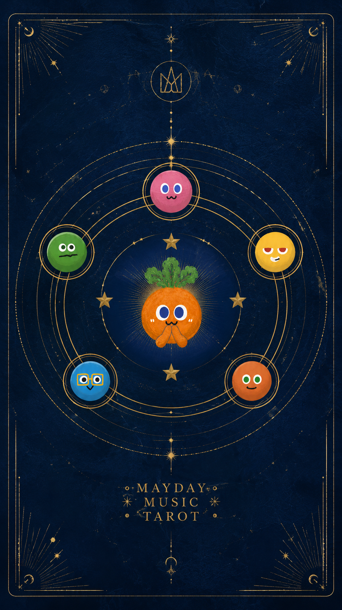

<div align="center">
  

  <h1>五月天 · 命运唱片行</h1>
  <p>一个把五月天九张专辑做成塔罗牌阵的沉浸式音乐播放器。</p>

  <p>
    
    
    
    
    
  </p>
</div>

## 项目简介

五月天 · 命运唱片行是一个音乐主题交互 Web App。项目将五月天 1999-2016 年的 9 张代表专辑映射为 9 张塔罗卡牌，用户可以通过拖拽、抽牌动画或摄像头手势选中专辑，再进入唱片播放器查看专辑故事、曲目列表、同步歌词、音频可视化和 AI 生成的「阿信式」音乐回应。

> 简历一句话：五月天 · 命运唱片行：基于 React 19 + TypeScript + Vite + Express + Tailwind CSS + Web Audio API + MediaPipe Hands + GLM-4-Flash，实现了融合五月天专辑塔罗抽卡、FLAC/网易云音乐播放、实时歌词、音频可视化、手势交互与 AI 歌词解读的沉浸式音乐播放器。

## 功能亮点

- 专辑塔罗牌阵：9 张专辑对应 9 张塔罗卡牌，支持横向滚动、随机抽牌、翻牌和卡牌收藏视图。
- 沉浸式唱片播放器：支持播放/暂停、下一首、顺序播放、随机播放、单曲循环、进度拖动和静音控制。
- 音频播放策略：优先通过网易云接口获取可播放音源，失败时回退到本地 FLAC，再失败时使用 Web Audio API 合成旋律兜底。
- FLAC 解码能力：内置 `@wasm-audio-decoders/flac`，在浏览器原生解码失败时使用 WASM 解码。
- 实时歌词体验：支持 LRC 解析、歌词高亮、自动滚动和点击歌词跳转播放进度。
- 音频可视化：基于 `AnalyserNode` 绘制频谱光环、粒子和唱片氛围动画。
- 摄像头手势控制：基于 MediaPipe Hands 识别掌心、食指、握拳、摇滚手势，用于滑动牌阵、确认抽牌、翻牌和返回。
- AI 音乐解读：服务端接入 GLM-4-Flash，根据所选专辑、用户问题和代表歌词生成温暖回复、推荐歌曲和一句箴言。
- 网易云音乐集成：封装搜索、播放链接、歌词、登录状态、扫码登录和手机号登录相关接口。
- 全屏视觉场景：星空背景、抽牌光束、专辑封面、旋转唱片和卡牌动效组成完整主题体验。

## 技术栈

| 分类 | 技术 |
| --- | --- |
| 前端框架 | React 19, TypeScript, Vite |
| 样式与动效 | Tailwind CSS 4, lucide-react, motion |
| 音频能力 | Web Audio API, HTMLAudioElement, WASM FLAC Decoder |
| 手势识别 | MediaPipe Hands, Camera Utils |
| 后端服务 | Express, tsx, esbuild |
| 音乐接口 | NeteaseCloudMusicApi |
| AI 接口 | GLM-4-Flash |

## 项目架构

```text
mayday-tarot-music-player
├── public/
│   ├── album_music/          # 本地 FLAC 音频资源
│   └── images/               # 塔罗牌背面与 9 张专辑卡面
├── src/
│   ├── components/           # 卡牌、牌阵、歌词、可视化、手势组件
│   ├── utils/                # 音频播放器与 LRC 解析
│   ├── App.tsx               # 主交互流程与页面状态
│   ├── data.ts               # 专辑、曲目、歌词片段、FLAC 映射
│   └── types.ts              # 业务类型定义
├── server.ts                 # Express API 与 Vite 中间件服务
├── vite.config.ts            # Vite + React + Tailwind 配置
└── package.json
```

## 快速开始

### 环境要求

- Node.js 18+
- npm 9+
- 可选：GLM API Key，用于启用 AI 回复

### 安装依赖

```bash
npm install
```

### 配置环境变量

复制 `.env.example` 为 `.env`，按需填写：

```bash
GLM_API_KEY="your_glm_api_key_here"
PORT=3000
```

未配置 `GLM_API_KEY` 时，AI 问答会自动使用本地兜底文案，项目仍可正常运行。

### 本地开发

```bash
npm run dev
```

启动后访问：

```text
http://localhost:3000
```

### 生产构建

```bash
npm run build
npm run start
```

## 核心流程

1. 用户进入首页，点击开启「命运唱片行」。
2. 在塔罗牌阵中拖拽、点击或使用手势选择专辑。
3. 系统播放抽牌过渡动画，并随机选中该专辑中的一首歌。
4. 播放器优先请求网易云播放链接，失败后尝试本地 FLAC，最后回退为合成旋律。
5. 用户可以查看歌词、切换曲目、翻看专辑故事，也可以输入问题获取 AI 音乐回应。

## API 说明

| 方法 | 路径 | 说明 |
| --- | --- | --- |
| `GET` | `/health` | 健康检查 |
| `GET` | `/api/music/play` | 按歌名与专辑名获取播放链接 |
| `GET` | `/api/music/lyric` | 获取歌词 |
| `GET` | `/api/music/status` | 检查网易云登录状态 |
| `GET` | `/api/music/qrcode` | 生成网易云扫码登录二维码 |
| `GET` | `/api/music/qrcode/check` | 检查扫码登录状态 |
| `POST` | `/api/music/login` | 手机号密码登录 |
| `POST` | `/api/oracle` | 生成 AI 音乐解读 |

## 开发脚本

| 命令 | 说明 |
| --- | --- |
| `npm run dev` | 启动 Express + Vite 开发服务 |
| `npm run build` | 构建前端并打包服务端 |
| `npm run start` | 启动生产构建产物 |
| `npm run lint` | 执行 TypeScript 类型检查 |

## 项目数据

- 专辑数量：9 张
- 曲目数量：119 首
- 本地资源：专辑卡面、塔罗牌背面、本地 FLAC 音频
- 交互模式：鼠标拖拽、点击抽牌、摄像头手势、键盘 Escape 返回

## 注意事项

- MediaPipe 相关脚本通过 CDN 加载，摄像头手势功能需要浏览器授权摄像头权限。
- 网易云音乐接口受网络环境、账号权限和版权策略影响，项目已提供本地音频与合成旋律兜底。
- 本项目使用的音乐、歌词与专辑视觉素材仅用于个人学习和作品展示，请勿用于商业用途。
